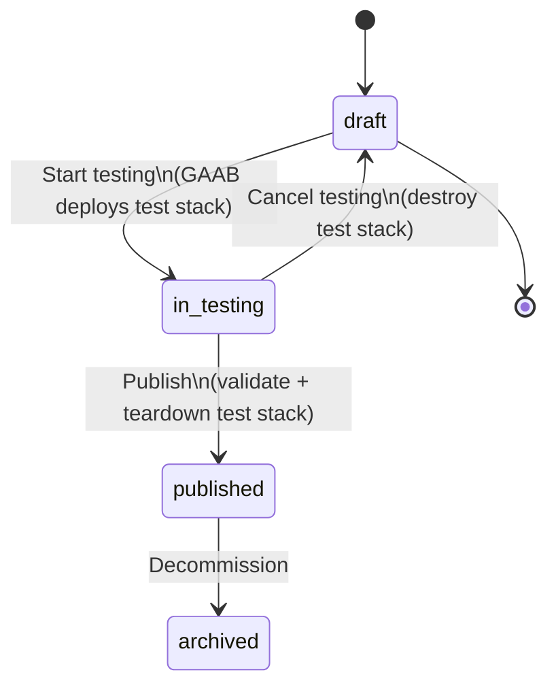
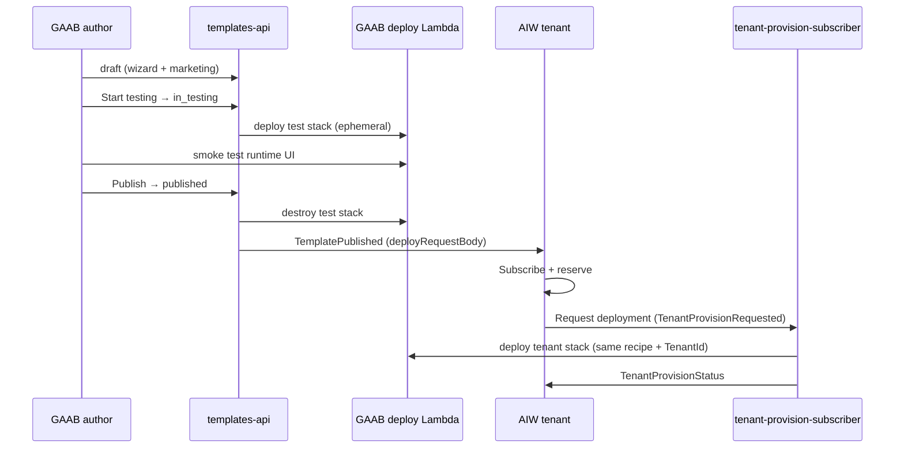

# Template lifecycle plan — draft → in testing → published

**Status:** P1 implemented (in_testing lifecycle) — deploy CDK + UI assets to AWS for E2E  
**Replaces:** Prior “reference use case + clone on activate” direction in this doc  
**Keeps:** AIW **Request deployment** → `TenantProvisionRequested` → GAAB deploy per tenant  
**Related:** `docs/AIW_EVENTBRIDGE.md`, `contracts/AGENT_TEMPLATE_CONTRACT.md` (AIW), `docs/SCHEDULED_AUTOMATION_PLAN.md` (defer)

---

## 1. Problem with the current model

| Risk | Why it hurts |
|------|----------------|
| **Publish without running deploy** | Template can publish with empty or untested `deployRequestBody`; tenant deploy fails at subscribe. |
| **No author test gate** | First real stack test is under a paying tenant. |
| **Clone / reference models** | Extra complexity; not required if publish carries a **proven** deploy recipe. |

**Decision:** Authors must pass an **in testing** phase that **deploys and exercises** the same metadata tenants will use. **Publish** freezes that recipe. **Tenants** still use **Request deployment** from AIW (one new stack per tenant, standard GAAB deploy — **not** clone).

---

## 2. Target model (summary)

| Layer | Today (broken) | Target |
|--------|----------------|--------|
| **Template statuses** | `draft` → `published` | `draft` → **`in_testing`** → `published` → `archived` |
| **Author validation** | Optional JSON only | **Mandatory** deploy + test in `in_testing` |
| **Test stack** | N/A | Ephemeral; **destroyed** when leaving `in_testing` |
| **Published `devops`** | Often empty | **`provisioning.deployRequestBody`** proven in testing |
| **Tenant deploy** | AIW Request deployment (keep) | Same — **no clone**, no shared reference stack |
| **Multi-tenancy** | One stack per tenant on Request deployment | Unchanged (isolated stacks per `TenantId`) |

---

## 3. Template status machine (GAAB)

### 3.1 Status values

| Status | Editable? | In AIW catalog? | Stack |
|--------|-----------|-----------------|-------|
| **`draft`** | Yes | No | None |
| **`in_testing`** | Limited (see §3.4) | No | **One ephemeral test stack** |
| **`published`** | No (existing rule) | Yes | None (test stack torn down) |
| **`archived`** | No | No (TemplateUnpublished) | None |

Add constant: `STATUS_IN_TESTING = 'in_testing'`.

### 3.2 Transitions

| From | To | Actions |
|------|-----|---------|
| `draft` | `in_testing` | Validate `deployRequestBody` complete → invoke GAAB deploy → store `testingUseCaseId`, `testingStackStatus` → status `in_testing` |
| `in_testing` | `draft` | **Destroy test stack** (delete use case / CFN) → clear testing fields → `draft` |
| `in_testing` | `published` | Require testing success (§3.5) → **destroy test stack** → freeze `deployRequestBody` on template → `TemplatePublished` → `published` |
| `published` | `archived` | `TemplateUnpublished` (unchanged) |

**Rule:** Cannot go `draft` → `published` directly.  
**Rule:** Test stack deletion happens **only** on:
- **Publish** (after `TestingValidatedAt` + active deploy + all publish gates)
- **Cancel testing** (operator choice)
- **Restart testing** (replace test stack with a new deploy)

**Never** delete on refresh status, deploy timeout, or API Gateway timeout. Failed deploys keep the stack so you can inspect logs or cancel manually.

### 3.3 Entering `in_testing` — GAAB deploy (author)

1. Author completes Agent wizard → **Generate JSON** → `devops.gaab.provisioning.deployRequestBody` on draft (same shape as today).
2. Author clicks **Start testing** (templates list or editor).
3. **templates-api** (or async worker):
   - Validates deploy body (SystemPrompt, LlmParams, UseCaseType, etc. — reuse `validateDevopsForPublish` rules).
   - Invokes **Agent Management deploy** Lambda with deploy body (no `TenantId` — operator test stack).
   - Writes template fields:
     - `Status = in_testing`
     - `TestingUseCaseId`, `TestingUseCaseName`
     - `TestingStartedAt`, `TestingDeployStatus` (`deploying` | `active` | `failed`)
   - Polls / webhook until stack **active** or **failed** (reuse use-case status patterns).
4. UI shows **Open test deployment** link when active.

Deploy is **internal to GAAB** — no AIW EventBridge on this step.

### 3.4 While `in_testing`

| Allowed | Blocked |
|---------|---------|
| Open test runtime UI | Edit marketing slug if it would confuse catalog |
| Re-run smoke / mark “testing passed” | Publish without passing gate |
| **Cancel testing** → `draft` (teardown) | Save breaking changes to deploy body without re-test (force **Restart testing**) |
| Minor marketing text edits (optional policy) | Direct edit of frozen deploy JSON without restart testing |

**Recommendation:** Any change to `deployRequestBody` while `in_testing` sets `TestingDeployStatus = stale` and requires **Restart testing** (teardown + redeploy).

### 3.5 Publish gate (`in_testing` → `published`)

All required before publish:

1. `Status === in_testing`
2. `TestingDeployStatus === active` (stack healthy)
3. `TestingValidatedAt` set (author checkbox **“I verified this deployment”** or automated smoke hook — start with manual)
4. `deployRequestBody` passes `validateDevopsForPublish`
5. Marketing / billing / SLA / onboarding (existing publish rules)

On success:

1. **Teardown test stack** — delete use case by `TestingUseCaseId` (same path as dashboard delete).
2. Clear `TestingUseCaseId` / testing fields (or move to audit `LastTestingUseCaseId` if needed).
3. Set `Status = published`, emit **`TemplatePublished`** with full `devops` including **`provisioning.deployRequestBody`**.
4. AIW catalog upsert (unchanged subscriber).

### 3.6 Teardown test stack (leaving `in_testing`)

**Always** run when:

- Cancel testing → `draft`
- Publish → `published`
- **Restart testing** (optional action: teardown then redeploy while staying `in_testing`)

Implementation:

- Call existing **use-case delete** command (CFN stack delete + DDB cleanup).
- If teardown fails: block status transition; surface error; allow retry teardown.
- Idempotent: second teardown no-op if stack already gone.

**Do not** leave orphan test stacks in the account.

---

## 4. Published metadata (tenant deploy recipe)

Publish carries everything AIW + GAAB need for **Request deployment** — no clone, no live reference `UseCaseId`.

### 4.1 `devops.gaab.provisioning.deployRequestBody` (required on publish)

Same schema as today’s Agent wizard output, e.g.:

- `UseCaseType`, `AgentParams`, `LlmParams`, MCP/tool config references
- Proven because **in_testing** deployed this exact body successfully

Optional additions on template record at publish:

- `devops.gaab.provisioning.provenance.testingValidatedAt`
- `devops.gaab.provisioning.provenance.testingUseCaseName` (audit only; stack deleted)

**Do not** publish `runtimeReference` / golden use case id as the tenant path.

### 4.2 What AIW stores

`AgentTemplate.devops` = published payload (including `deployRequestBody`).  
Catalog / workspace unchanged except copy: deploy happens on **Request deployment**, not at subscribe.

---

## 5. Tenant flow (AIW — unchanged semantics)

1. **Catalog** — published templates only.
2. **Subscribe & reserve** — Stripe + `TenantTemplateInstance` `pending` (unchanged).
3. **Request deployment** — tenant clicks button → AIW `provision-request-publisher`:
   - Validates template has non-empty `deployRequestBody`
   - Emits **`TenantProvisionRequested`** with `devops` from catalog + `tenantId`
4. **GAAB `tenant-provision-subscriber`** — merge `TenantId` into body → invoke deploy Lambda → **`TenantProvisionStatus`**
5. **AIW** — instance `provisioning` → `active` | `failed`; **Open app** with tenant `runtimeUiUrl`

**Multi-tenancy:** Each tenant Request deployment creates a **new** stack from the **same published recipe** (not clone-from-reference, not shared stack).

### 5.1 Fixes to keep from recent work

| Fix | Keep? |
|-----|-------|
| Reject empty `deployRequestBody` at AIW provision request | Yes |
| Reject empty body at GAAB subscriber | Yes |
| Publish blocked without validated deploy body | Yes — enforced via `in_testing` gate |
| Auto-reserve after Stripe checkout | Yes |
| `TenantProvisionStatus` subscriber | Yes |

### 5.2 Deprecate / do not build

- `TenantActivateRequested`
- Clone-from-reference in `tenant-provision-subscriber`
- `runtimeReference` as primary catalog contract
- “Activate” replacing Request deployment in AIW UX

---

## 6. GAAB UI changes

### 6.1 Templates list

| Status | Actions |
|--------|---------|
| `draft` | Edit, **Start testing** |
| `in_testing` | **Open test app**, **Publish**, **Cancel testing**, (optional) **Restart testing** |
| `published` | View, **Decommission** |
| `archived` | View only |

Remove direct **Publish** from `draft`.

### 6.2 Template editor (`TemplateCreateView.jsx`)

- Editable in `draft` and `in_testing` (with stale/restart rules in testing).
- Status banner per state.
- **Start testing** disabled until wizard JSON valid.
- Publish button only when `in_testing` + validation passed.

### 6.3 Agent wizard

Keep as **source of `deployRequestBody`** — this is what gets deployed in testing and frozen at publish.

---

## 7. GAAB API changes (`templates-api`)

| Endpoint / action | Purpose |
|-------------------|---------|
| `POST /templates/{id}/start-testing` | `draft` → deploy → `in_testing` |
| `POST /templates/{id}/cancel-testing` | Teardown → `draft` |
| `POST /templates/{id}/restart-testing` | Teardown + redeploy, stay `in_testing` |
| `POST /templates/{id}/mark-testing-validated` | Set `TestingValidatedAt` (if manual gate) |
| `POST /templates/{id}/publish` | Only from `in_testing`; teardown + EventBridge |
| `PUT /templates/{id}` | Block or restrict when `published` / `archived` (extend for `in_testing`) |

DynamoDB fields (template item):

| Field | When set |
|-------|----------|
| `TestingUseCaseId` | Start testing |
| `TestingDeployStatus` | Deploy lifecycle |
| `TestingValidatedAt` | Author confirms smoke test |
| `TestingStartedAt` / `TestingEndedAt` | Audit |

---

## 8. AIW changes

| Area | Action |
|------|--------|
| Request deployment UX | **Keep** label and flow |
| `provision-request-publisher` | **Keep**; validate `deployRequestBody` from template |
| `template-published-subscriber` | **Keep**; store full `devops` from event |
| Catalog copy | “Deployment provisioned when you request deployment” |
| Workspace | **Request deployment** / **Open app** states (unchanged) |

No activate/clone path.

---

## 9. Implementation phases

| Phase | Scope | E2E gate |
|-------|--------|----------|
| **P0 — Data reset** | Wipe templates, AIW instances, Stripe test sub (§11) | Clean slate |
| **P1 — Status + in_testing deploy** | New status, start/cancel testing, teardown, UI | Draft → in_testing → open test UI |
| **P2 — Publish gate + TemplatePublished** | Publish only from in_testing; proven `deployRequestBody` | Template in AIW catalog |
| **P3 — AIW tenant deploy** | Request deployment E2E (existing path hardened) | Tenant stack active |
| **P4 — Second tenant** | Same template, second Request deployment | Two isolated stacks |
| **P5 — Extensions + schedules** | MCP overlay, `SCHEDULED_AUTOMATION_PLAN.md` | After P3 stable |

---

## 10. E2E test script (after P3)

1. GAAB: Create **draft** → complete wizard → **Start testing** → wait active → smoke test → **Publish** → confirm test stack **gone** in dashboard.
2. AIW: Template visible with pricing → subscribe → reserve.
3. AIW: **Request deployment** → `provisioning` → `active` → **Open app**.
4. GAAB: One **tenant** use case (not the deleted test id).
5. Second tenant: repeat → **different** `UseCaseId`.
6. Decommission template → AIW catalog archived.

---

## 11. Data reset checklist (before P1) — **approved**

| System | Action | Owner |
|--------|--------|-------|
| **Stripe** | Cancel test subscription(s) | **Operator** (not automated by this project) |
| **AIW users** | **Do not delete** Cognito / `TenantProfile` (single test user kept) | — |
| **AIW `TenantTemplateInstance-*`** | Delete **all** rows (clears workspace / subscription instance refs) | Script or console |
| **AIW `AgentTemplate-*`** | Delete **all** rows (clears catalog mirror from GAAB publishes) | Script or console |
| **AIW `TenantProfile-*`** | **Keep** user row(s); clear `stripeCustomerId` / subscription-related fields if present so re-subscribe is clean | Script or console |
| **GAAB `AgentTemplatesTable`** | Delete **all** template rows | Script or API |
| **GAAB use cases** | Optional: delete orphan failed stacks only; **not** required for P0 if operator prefers manual cleanup | Operator |

After P0: one AIW user remains; no templates in GAAB or AIW catalog; no tenant template instances; Stripe handled separately.

---

## 12. Risks

| Retired | New (managed) |
|---------|----------------|
| Publish without deploy test | `in_testing` required |
| Empty deploy JSON at tenant | Publish + AIW validation |
| Clone complexity | Standard deploy only |
| Orphan test stacks | Mandatory teardown on exit `in_testing` |

| New risk | Mitigation |
|----------|------------|
| Teardown fails | Block transition; retry button |
| Author publishes without real smoke | Manual `TestingValidatedAt` + later automated checks |
| Long test deploy time | `TestingDeployStatus` + UI polling |
| Tenant deploy differs from test | Same `deployRequestBody` blob frozen at publish |

---

## 13. Files to touch

**GAAB**

- `source/lambda/templates-api/index.ts`, `catalog-fields.ts`, `utils/constants.ts`
- New: `template-testing.ts` or worker for deploy/teardown invoke
- `source/ui-deployment/src/components/templates/TemplateCreateView.jsx`, `TemplatesListView.jsx`
- `source/lambda/tenant-provision-subscriber/index.ts` — **keep** deploy-from-event path; remove any clone/reference experiments
- `docs/AIW_EVENTBRIDGE.md`

**AIW**

- `contracts/AGENT_TEMPLATE_CONTRACT.md` — document in_testing on GAAB side; tenant flow unchanged
- `amplify/functions/provision-request-publisher/handler.ts` — keep
- `src/app/dashboard/workspace/page.tsx` — keep Request deployment

---

## 14. Decisions

| # | Decision | Status |
|---|----------|--------|
| 1 | Author validation | **`draft` → `in_testing` → `published`** with ephemeral test stack |
| 2 | Test stack on exit `in_testing` | **Destroy** (publish or cancel) |
| 3 | Tenant multi-tenancy | **Request deployment** per tenant (standard deploy, **no clone**) |
| 4 | Published payload | **`deployRequestBody`** proven in testing |
| 5 | P0 data reset | **Approved** — see §11: keep all users; delete all templates (GAAB + AIW `AgentTemplate`); delete all `TenantTemplateInstance`; clear Stripe fields on profile; operator handles Stripe subscriptions |

---

## 15. Rejected approaches (do not implement)

- Link pre-existing golden use case at template create
- `runtimeReference` as tenant deploy source
- Clone on activate / `TenantActivateRequested`
- Shared reference stack for all tenants
- Removing AIW Request deployment
